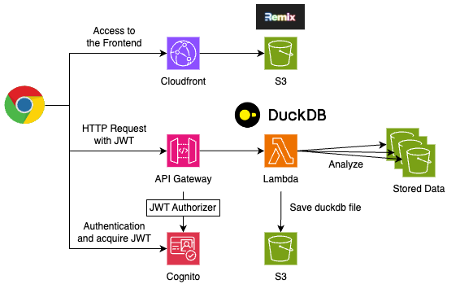

<p align="center">
  
</p>

CloudDuck is a simple and easy-to-use analysis environment for S3 data, featuring DuckDB with built-in authentication.

<p align="center">
  
</p>

## Architecture



## Installation

```bash
npm i cloud-duck
```

## Usage

### Deploy

```typescript
import { CloudDuck } from 'cloud-duck';

declare const logBucket: s3.IBucket;

new CloudDuck(this, 'CloudDuck', {
  // The S3 bucket to analyze
  // CloudDuck can access to all of the buckets in the account by default.
  // If you want to restrict the access, you can use the targetBuckets property.
  targetBuckets: [logBucket],
});
```

### Add user to the Cognito User Pool

